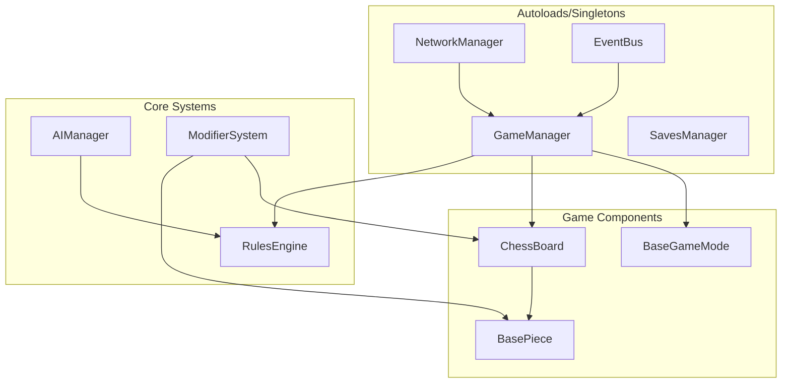

# Custom Chess Game - Development Plan

This plan outlines the development of a highly scalable and modular custom chess game in Godot 4.5, designed to support extensive customization of pieces, boards, events, and game modes.

## Overview

Build a chess game from ground-up with extreme focus on scalability, using composition and interface-based architecture to support future custom pieces, boards, events, and radically different game modes including real-time variants.---

## Architecture Overview



---

## Project Structure

```javascript
res://
├── autoloads/
│   ├── game_manager.gd
│   ├── saves_manager.gd
│   ├── network_manager.gd
│   └── event_bus.gd
├── scripts/
│   ├── core/
│   │   ├── base_piece.gd
│   │   ├── base_board.gd
│   │   ├── base_game_mode.gd
│   │   ├── rules_engine.gd
│   │   └── modifier_system.gd
│   ├── pieces/
│   │   ├── king.gd, queen.gd, rook.gd, etc.
│   │   └── custom/
│   ├── boards/
│   │   └── standard_board.gd
│   ├── game_modes/
│   │   ├── classic_mode.gd
│   │   └── custom/
│   ├── events/
│   │   ├── base_event.gd
│   │   └── custom/
│   └── ai/
│       ├── ai_player.gd
│       ├── evaluator.gd
│       └── search_algorithms.gd
├── scenes/
│   ├── main.tscn
│   ├── game/
│   ├── ui/
│   └── pieces/
└── resources/
    ├── piece_data/
    ├── board_data/
    └── event_data/
```

---

## Phase 1: Core Chess Game (Weeks 1-4)

**Goal:** Playable standard chess with solid, extensible architecture.

### Week 1: Foundation and Board System

- Set up project structure following Godot best practices (loose coupling, signals for communication)
- Create `BasePiece` class with:
- Movement pattern system (direction vectors, max range, can_jump flag)
- Virtual methods: `get_legal_moves()`, `on_move()`, `on_capture()`, `on_death()`
- Modifier support via composition (Array of `PieceModifier` resources)
- Create `BaseBoard` class with:
- Flexible grid system (configurable rows/columns)
- Square state management (blocked, special, etc.)
- Piece placement/removal via signals

### Week 2: Piece Implementation and Movement

- Implement standard pieces (King, Queen, Rook, Bishop, Knight, Pawn) extending `BasePiece`
- Create `RulesEngine` class handling:
- Move validation interface (injectable for custom modes)
- Special rules: castling, en passant, pawn promotion
- Check/checkmate/stalemate detection
- Input handling for piece selection and movement

### Week 3: Game Logic and State Management

- Create `GameManager` autoload:
- Turn management (extensible for real-time modes later)
- Game state machine (setup, playing, paused, ended)
- Win condition checking (delegated to game mode)
- Create `BaseGameMode` class:
- Virtual methods: `check_win_condition()`, `on_turn_start()`, `on_turn_end()`
- `ClassicMode` implementation for standard chess
- Create `EventBus` autoload for decoupled communication

### Week 4: UI, Saves, and Polish

- Main menu scene (New Game, Load Game, Settings)
- In-game UI (turn indicator, captured pieces, move history)
- Create `SavesManager` autoload:
- Serialize game state to JSON/Resource
- Support for move history (PGN-like format for replay)
- Visual feedback (legal move highlights, check indicators)

---

## Phase 2: Multiplayer (Weeks 5-7)

**Goal:** Online play with room-based matchmaking.

### Week 5: Network Architecture

- Create `NetworkManager` autoload using Godot's high-level multiplayer API
- Implement server/client architecture with:
- Room creation and joining via room codes
- Player synchronization
- State authority (server-authoritative for anti-cheat)

### Week 6: Game Synchronization

- RPC-based move validation and execution
- Spectator support architecture
- Reconnection handling
- Chat system

### Week 7: Lobby and Polish

- Lobby UI (room list, create room, join by code)
- Player profiles (name, stats)
- Network error handling and timeouts
- Menu integration (Online Play option)

---

## Phase 3: Chess AI (Weeks 8-11)

**Goal:** Adaptive AI that can handle custom rules and pieces.

### Week 8: AI Foundation

- Create `AIPlayer` class with pluggable strategy pattern
- Create `Evaluator` class:
- Material evaluation (piece values as resources for customization)
- Positional evaluation (piece-square tables)
- Extensible via `EvaluationComponent` system for custom factors

### Week 9: Search Implementation

- Implement search algorithms from Chess Programming Wiki:
- Minimax with Alpha-Beta pruning
- Iterative deepening
- Move ordering (captures first, killer moves)
- Transposition tables (optional optimization)
- Difficulty levels via search depth and evaluation noise

### Week 10: AI Adaptability System

- Design AI to query `RulesEngine` for legal moves (not hardcoded)
- Evaluation system that reads piece values from `BasePiece.value` property
- Support for custom win conditions via `GameMode.evaluate_position()`
- Time-based move limits for real-time modes

### Week 11: Integration and Testing

- AI vs AI testing mode
- Difficulty presets (Easy, Medium, Hard, Expert)
- AI move visualization (thinking indicator)
- Menu integration (vs AI option with difficulty selection)

---

## Phase 4: Custom Content System (Weeks 12-18)

**Goal:** Extensible framework for unlimited customization.

### Week 12-13: Custom Pieces Framework

Extend `BasePiece` to support:

- **Movement Modifiers:** Configurable via `MovePattern` resource
- Direction vectors, range, jumping ability
- Conditional movement (first move only, must capture, etc.)
- **Abilities System:** `PieceAbility` resource with:
- Trigger types: active (cooldown), passive, on_death, on_kill, on_move
- Cooldown system (turn-based or real-time timer)
- **Rarity System:** Enum (Common, Uncommon, Rare, Epic, Legendary, Ancient)
- Implement 2-3 custom pieces as proof of concept

### Week 14-15: Custom Boards Framework

Extend `BaseBoard` to support:

- **Dynamic Grid:** Non-rectangular shapes, holes, blocked squares
- **Square Effects:** `SquareModifier` resource (teleporter, hazard, buff zone)
- **Board Events:** Timer/trigger-based board state changes
- Implement 2-3 custom boards as proof of concept

### Week 16-17: Events System

Create hierarchical event system:

- **`BaseEvent`** class with:
- Trigger conditions (random, turn-based, position-based, player-triggered)
- Duration (instant, timed, permanent)
- Affected scope (piece, square, board, game)
- **Event Categories:**
- `PieceEvent`: Transform, buff/debuff, curse
- `BoardEvent`: Add obstacles, spawn items, environmental effects
- `GlobalEvent`: Rule changes, win condition modifications
- Implement 3-5 events per category as proof of concept

### Week 18: Custom Game Modes

Create `BaseGameMode` extensions for variant rules:

- **King of the Hill:** Custom win condition checking center squares
- **Three-Check:** Track check count, modified win condition
- **Capture the King:** Disable check rules, modify king capture
- **Real-Time Chess (Kung Fu Chess):** Per-piece cooldown timers, no turns
- Each mode overrides relevant methods in `BaseGameMode`

---

## Phase 5: Player Abilities and Advanced Features (Weeks 19-22)

### Week 19-20: Player Abilities

- Create `PlayerAbility` system:
- Resource-based ability definitions
- Cooldown/charge system
- UI for ability selection and activation
- Ability types: trigger events, transform pieces, place traps, move pieces

### Week 21-22: Integration and Polish

- Rarity-based drop rates and AI difficulty scaling
- Custom game builder UI (select board, pieces, events, modes)
- Achievement/progression system hooks
- Comprehensive playtesting and balancing

---

## Key Design Decisions

### Scalability Patterns

1. **Composition over Inheritance:** Pieces use `Modifier` and `Ability` components rather than deep inheritance
2. **Resource-Based Configuration:** Piece stats, abilities, and events defined as `.tres` resources for easy editing
3. **Signal-Based Communication:** Use `EventBus` autoload to decouple systems
4. **Strategy Pattern for AI:** AI queries `RulesEngine` interface, doesn't know specific rules
5. **Game Mode Abstraction:** All game logic flows through `BaseGameMode` virtual methods

### Godot Best Practices Applied

- **Autoloads** for global managers (GameManager, SavesManager, NetworkManager, EventBus)
- **Scenes as building blocks** for pieces, boards, UI components
- **Loose coupling** via signals and dependency injection
- **Resource files** for data-driven content (piece definitions, events)
- **Group system** for efficient entity queries

---

## Deadline Summary

| Phase | Duration | End Date (from start) ||-------|----------|----------------------|| Phase 1: Core Chess | 4 weeks | Week 4 || Phase 2: Multiplayer | 3 weeks | Week 7 || Phase 3: Chess AI | 4 weeks | Week 11 || Phase 4: Custom Content | 7 weeks | Week 18 || Phase 5: Advanced Features | 4 weeks | Week 22 |**Total Estimated Time: 22 weeks (~5.5 months)**---

## Notes on AI Adaptability